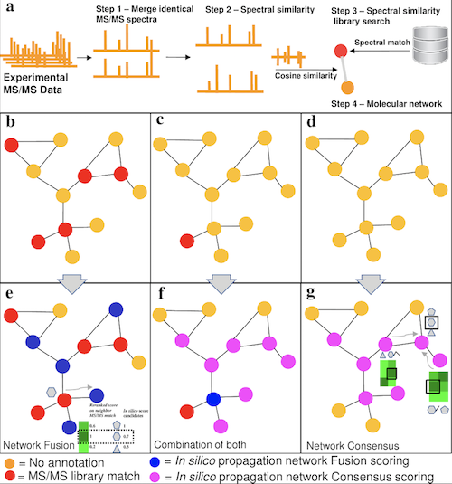

# Network Annotation Propagation

### Table of contents

* [Description](#description)
* [Graphical abstract](#graphical_abstract)
* [Main citation](#main_citation)
* [Other citations](#other_citations)
* [Running NAP on GNPS](#running_nap_on_gnps)
  * [Documentation](#documentation)
  * [Creating a custom database](#creating_a_custom_database)
* [Installation for developers](#installation_for_developers)
* [Help and Troubleshooting](#help-and-troubleshooting)
* [License](#licence)

## Description

Network Annotation Propagation uses molecular networking to improve the accuracy of in silico predictions through propagation of structural annotations, even when there is no match to a MS/MS spectrum in spectral libraries. This is accomplished through creating a network consensus of re-ranked structural candidates using the molecular network topology and structural similarity to improve in silico annotations.

The Network Annotation Propagation (NAP) tool is accessible through the GNPS web-platform https://gnps.ucsd.edu/ProteoSAFe/static/gnps-theoretical.jsp

## Graphical abstract

Figure 1. Representative scenarios of molecular networks obtained in an untargeted MS/MS experiment and possibilities for propagation.
a) Introduction of molecular networking and library matching. b, c and d represent varying degree of spectral annotation in the network. e, f and g illustrate how the propagation of annotations can be used for each respective scenario (represented in the top panel). e) The Fusion scoring—The spectral library hit nodes (red) are employed to recalculate the score of candidate structures (grey shapes associated to nodes) for nodes having structure candidates from in silico fragmentation search (blue), based on their structural similarity (Represented by the green heatmaps, where darker green indicates a higher degree of similarity). f) and g) The Consensus scoring—a Consensus scoring can be used, based on the joint similarity of neighbors (pink nodes) for spectral library hits and in silico annotations (f), or in silico annotation only, when no library match is present (g).

## Main citation
da Silva, R. R.; Wang, M.; Nothias, L.-F.; van der Hooft, J. J. J.; Caraballo-Rodríguez, A. M.; Fox, E.; Balunas, M. J.; Klassen, J. L.; Lopes, N. P.; Dorrestein, P. C. Propagating Annotations of Molecular Networks Using in Silico Fragmentation. PLoS Comput. Biol. 2018, 14 (4), e1006089.
http://journals.plos.org/ploscompbiol/article?id=10.1371/journal.pcbi.1006089

## Other citations
NAP uses molecular networking on GNPS
Wang, M.; Carver, J. J.; Phelan, V. V.; Sanchez, L. M.; Garg, N.; Peng, Y.; Nguyen, D. D.; Watrous, J.; Kapono, C. A.; Luzzatto-Knaan, T.; et al. Sharing and Community Curation of Mass Spectrometry Data with Global Natural Products Social Molecular Networking. Nat. Biotechnol. 2016, 34 (8), 828–837.

NAP uses MetFrag for in silico annotation
Wolf, S.; Schmidt, S.; Müller-Hannemann, M.; Neumann, S. In Silico Fragmentation for Computer Assisted Identification of Metabolite Mass Spectra. BMC Bioinformatics 2010, 11 (1), 148.
https://bmcbioinformatics.biomedcentral.com/articles/10.1186/1471-2105-11-148

NAP uses the Fusion concept, proposed on for MetFusion, for ranking improvement from spectral library.
Gerlich, M.; Neumann, S. MetFusion: Integration of Compound Identification Strategies. J. Mass Spectrom. 2013, 48 (3), 291–298.
https://onlinelibrary.wiley.com/doi/abs/10.1002/jms.3123


## Running NAP on GNPS
The Network Annotation Propagation (NAP) tool is accessible through the GNPS web-platform https://gnps.ucsd.edu/ProteoSAFe/static/gnps-theoretical.jsp

### Documentation
The documentation is available here:
https://github.com/DorresteinLaboratory/NAP_ProteoSAFe/raw/master/supplementar_tool_manual_documentation.pdf

### Creating a custom database
#### Description
A custom database can be used as input in NAP. The list of structure has to be processed first with dedicated Jupyter notebook [http://jupyter.org/install].
The notebook and input template files are available in the following folder.
https://github.com/DorresteinLaboratory/NAP_ProteoSAFe/tree/master/formatdb
#### Installation instructions
First, install Miniconda https://conda.io/miniconda.html

In Miniconda, install Jupyter notebook: https://jupyter.readthedocs.io/en/latest/install.html
```
pip3 install --upgrade pip
pip3 install jupyter
```
After that, create an environment with the following command:
```
conda create -n formatdb python=3
source activate formatdb
conda install -c rdkit rdkit
pip install pandas
pip install ipykernel
pip install requests
python -m ipykernel install --user --name formatdb --display-name formatdb
source deactivate 
```
Note that Anaconda Navigator can used instead: https://docs.anaconda.com/anaconda/navigator/

Import the content of the following folder on your computer: https://github.com/DorresteinLaboratory/NAP_ProteoSAFe/tree/master/formatdb
Activate the formatdb environment in conda, and open the formatdb.ipynb with Jupyter notebook. 
In the Jupyter notebook, set the new kernel -> On the top menu Kernel >> Change Kernel >> formatdb.

The resulting output can be uploaded on GNPS, and specified as input in the NAP workflow interface.


## Installation for developers

Before installing NAP, install [ProteoSAFe](https://github.com/CCMS-UCSD/ProteoSAFe).

Make sure ProteoSAFe is running properly, you can learn more with the [workflow developer resources](http://proteomics.ucsd.edu/Software/ProteoSAFe/developer_resources/).

Futher documentation can be found at [Workflow XML file documentation](https://bix-lab.ucsd.edu/display/PS/XML+Configuration+Overview).

After ProteoSAFe installation download [MetFrag CL](http://c-ruttkies.github.io/MetFrag/) and place the jar file on the nap_ccms2/Snap directory.
Please refer to [MetFusion](http://onlinelibrary.wiley.com/doi/10.1002/jms.3123/abstract) and [MetFrag](https://bmcbioinformatics.biomedcentral.com/articles/10.1186/1471-2105-11-148) publications to learn more about the tools.

Edit the file install_all.txt to change the YOURPATHCONDAENV and YOURPATHTOOLSFOLDER variables. Alternatively, refer to ProteoSAFe documentation to encode the path at the tools xml file and avoid hardcoding.

After that, run the installation script to install the conda environment and all dependencies.

```
./install_all.txt
```
After installation move the nap_ccms2 folder to proteosafe/tools folder and nap_ccms2_workflow to proteosafe/workflows.
On proteosafe/workflows rename nap_ccms2_workflow to nap_ccms2.

NAP was installed and tested under 

```
Linux 4.9.0-2-amd64 #1 SMP Debian 4.9.18-1 (2017-03-30) x86_64 GNU/Linux
```

## Help and Troubleshooting
Refer to the documentation or open an issue on this GitHub repository, or post a message on the GNPS forum 
https://groups.google.com/forum/#!forum/molecular_networking_bug_reports

## Licence
This repository is available under the following licence https://github.com/DorresteinLaboratory/NAP_ProteoSAFe/blob/master/LICENSE.txt

